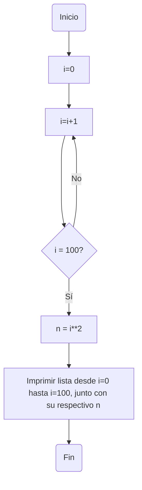

# reto_7

1. Imprimir un listado con los números del 1 al 100 cada uno con su respectivo cuadrado.

*Para este punto primero se inicializó la variable i en cero. Luego se utilizó ```while``` para hacer una iteración en la que se vaya haciendo una lista de números consecutivos (Sumando de uno en uno) así hasta llegar a cien. Cuando se llega a cien, se imprime la lista junto con su respectivo cuadrado separado por comas.*
```python
i= 0
while i < 100:
    i +=1
    print(i,i**2, sep=",")
```

2. Imprimir un listado con los números impares desde 1 hasta 999 y seguidamente otro listado con los números pares desde 2 hasta 1000.

*Para este punto utilicé ```while``` para hacer una lista de desde 1 hasta 999. Para la primera parte (Sólo números impares) agregué la condición de que si el residuo entre la variable i y 2 es cero, entonces que siga con el siguiente número y ese no lo tome en cuenta (Para esto utilicé ```Continue```.) En la segunda parte (Sólo números pares) hice la condición contraria y ahora en este caso la lista irá desde 2 hasta 1000.*

```python
i=0
while i < 999:
  i+=1
  if i%2==0:
    continue
  print(i)

i=1
while i < 1000:
  i+=1
  if i%2!=0:
    continue
  print(i)
```
3. Imprimir los números pares en forma descendente hasta 2 que son menores o iguales a un número natural n ≥ 2 dado
```python
n= int(input("Ingrese un número natural mayor o igual a dos: "))
while n>=2:
    n -=1
    if n%2!=0:
        continue
    print(n)
```
4. En 2022 el país A tendrá una población de 25 millones de habitantes y el país B de 18.9 millones. Las tasas de crecimiento anual de la población serán de 2% y 3% respectivamente. Desarrollar un algoritmo para informar en que año la población del país B superará a la de A.

```python
año: int = 2022
A : float = 25
B : float = 18.9
while B<=A:
    A+= (0.02*A) 
    B+= (0.03*B)
    año+=1

print("Para el año " + str(año)  +  " la población B superará a la población A")
```
5. Imprimir el factorial de un número natural n dado.
```python
def calcular_factorial(n: int) -> int:
    if n == 0 or n == 1:
        return 1  
    else:
        factorial = 1
        while n > 1:
            factorial *= n
            n -= 1
        return factorial

if __name__ == "__main__":
    n = int(input("ingrese un número natural: "))
    factorial=calcular_factorial(n)
print("El factorial de " + str(n) + " es " + str(factorial))
 ```
6. Implementar un algoritmo que permita adivinar un número dado de 1 a 100, preguntando en cada caso si el número es mayor, menor o igual.
 
 ```python
import random

print("Piensa en un número de 1 a 100")
numero_minimo = 1
numero_maximo = 100
num_random = random.randrange(numero_minimo, numero_maximo)
bandera = True

while bandera or respuesta != "igual":
    bandera = False
    respuesta = input("El número " + str(num_random) + " es igual, mayor o menor que el número en el que pensaste. Pon solo la palabra, todo en minúsculas: ")
    if respuesta == "mayor":
        numero_maximo = num_random 
        num_random = random.randrange(numero_minimo, numero_maximo)
    elif respuesta == "menor":
        numero_minimo = num_random 
        num_random = random.randrange(numero_minimo, numero_maximo)
    elif respuesta =="igual":
      print("El número que has pensado es " + str(num_random))
    else:
      print("Recuerda escribir todo en minúsculas, revisa que hayas escrito correctamente la palabra")
 ```
7.Implementar un programa que ingrese un número de 2 a 50 y muestre sus divisores.
```python
n = 0
i = int(input("ingrese un número natural entre 2 y 50: "))

while n<=i:
  n+=1
  if i%n==0 and i!=0 and i!=1 and i<50:
    print(n, end=", ")

if i == 0 or i==1:
  print("Ingrese un número mayor o igual a dos ")
elif i >50:
  print("Ingrese un menor o igual a cincuenta ")
  
print("\b\b")
```
8. Implementar el algoritmo que muestre los números primos del 1 al 100. Nota: use funciones

```python
ef calcular_numeros_primos(n):  #Definimos función
    while n <= 100:              #Hasta que n sea menor o igual que 100
        i = 2                    #Definimos i desde 2, ya que si lo definimos desde 1 sabemos que no podremos saber si n es un número es primo
        es_primo = True          #Definimos la función como verdadera
        while i < n:             #Desde que n sea mayor que i:
            if n % i == 0:       #Si el cociente entre n e i es cero
                es_primo = False #Entonces es_primo es false, por lo que no se trata de un número primo
                break            #Termina la iteración
            i += 1               #Sumamos 1 para seguir mirando si el siguiente número i cumple con dicha condición
        if es_primo:             #Si es_primo (Se trata de un número primo)
            print(n)             #Imprima n
        n += 1                   #Sume uno y siga mirando si el siguiente número n es primo

if __name__ == "__main__":
    n = 2                        #Definimos n
    calcular_numeros_primos(n)
```

