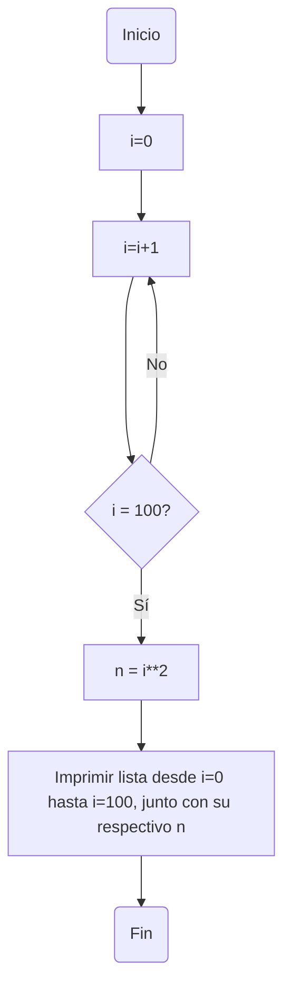
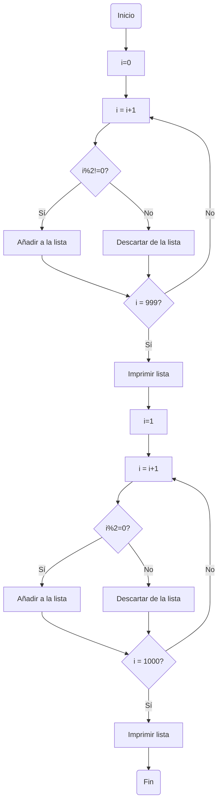
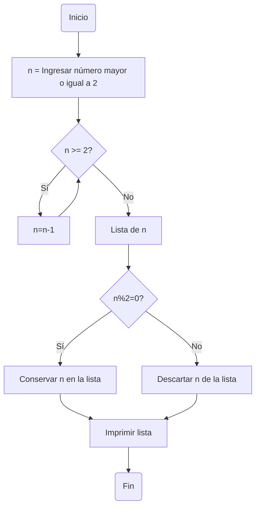

# reto_7

1. Imprimir un listado con los números del 1 al 100 cada uno con su respectivo cuadrado.

*Para este punto primero se inicializó la variable i en cero. Luego se utilizó ```while``` para hacer una iteración en la que se vaya haciendo una lista de números consecutivos (Sumando de uno en uno) así hasta llegar a cien. Cuando se llega a cien, se imprime la lista junto con su respectivo cuadrado separado por comas.*
```python
i= 0
while i < 100:
    i +=1
    print(i,i**2, sep=",")
```

2. Imprimir un listado con los números impares desde 1 hasta 999 y seguidamente otro listado con los números pares desde 2 hasta 1000.

*Para este punto utilicé ```while``` para hacer una lista de desde 1 hasta 999. Para la primera parte (Sólo números impares) agregué la condición de que si el residuo entre la variable i y 2 es cero, entonces que siga con el siguiente número y ese no lo tome en cuenta (Para esto utilicé ```Continue```.) En la segunda parte (Sólo números pares) hice la condición contraria y ahora en este caso la lista irá desde 2 hasta 1000.*

```python
i=0
while i < 999:
  i+=1
  if i%2==0:
    continue
  print(i)

i=1
while i < 1000:
  i+=1
  if i%2!=0:
    continue
  print(i)
```

   
3. Imprimir los números pares en forma descendente hasta 2 que son menores o iguales a un número natural n ≥ 2 dado

*Sabemos que el número debe ser mayor o igual que dos, asi que mientras se cumpla esto, se deberá restar a i consecutivamente hasta llegar hasta dos, pero solo imprimiendo los números que complan con la condición de ser pares. Es decir que n%2 = 0 se cumpla. El bucle ```n-=1``` debe ponerse luego del ```print``` para que también se imprima el número dado en caso tal de que fuera par*
```python
n = int(input("Ingrese un número natural mayor o igual a dos: "))

if n >= 2:
    while n >= 2:
        if n % 2 == 0:
            print(n)
        n -= 1
else:
    print("El número debe ser mayor o igual a dos.")
```

4. En 2022 el país A tendrá una población de 25 millones de habitantes y el país B de 18.9 millones. Las tasas de crecimiento anual de la población serán de 2% y 3% respectivamente. Desarrollar un algoritmo para informar en que año la población del país B superará a la de A.

```python
año: int = 2022 #Inicialización año
A : float = 25 #Inicialización A
B : float = 18.9 #Inicialización B
while B<=A:  #Mientras B sea menor que A 
    A+= (0.02*A) #Multiplica A por 0.02 y súmale al valor actual de A
    B+= (0.03*B) #Multiplica B por 0.03 y súmale al valor actual de B
    año+=1 #Suma 1 al año actual, consecutivamente 

print("Para el año " + str(año)  +  " la población B superará a la población A")
```
5. Imprimir el factorial de un número natural n dado.

*Para este punto se utilizó ```while``` de tal forma que se pudiera iterar con respecto a un valor dado. Este valor se va a restar consecutivamente hasta llegar a uno a la medida que se multiplican todos los resultados. Adicional se tiene la condición de que si n, que es el valor dado, es igual a 0 o 1, automáticamente el factorial será 1.*
```python
def calcular_factorial(n: int) -> int:
    if n == 0 or n == 1:
        return 1  
    else:
        factorial = 1
        while n > 1:
            factorial *= n
            n -= 1
        return factorial

if __name__ == "__main__":
    n = int(input("ingrese un número natural: "))
    factorial=calcular_factorial(n)
print("El factorial de " + str(n) + " es " + str(factorial))
 ```
6. Implementar un algoritmo que permita adivinar un número dado de 1 a 100, preguntando en cada caso si el número es mayor, menor o igual.

*Para este punto se importó la función ```Random``` la cual nos dará un número aleatorio. Luego de pedir a la persona que piense en un número, este número saldrá y la persona tendrá que decir si es "menor", "igual" o "mayor". Si el número dado es mayor o menor, se hace una condición para que el rango de números aleatorios se reduzca, de tal manera que se pueda adivinar el número. Si el número dado es igual al número aleatorio entonces el programa lo ha adivinado. Adicionalmente se usó una bandera para que el programa se ejecute correctamente y pueda iterarse cuantas veces sea necesario.*
 
 ```python
import random

print("Piensa en un número de 1 a 100")
numero_minimo = 1
numero_maximo = 100
num_random = random.randrange(numero_minimo, numero_maximo)
bandera = True

while bandera or respuesta != "igual":
    bandera = False
    respuesta = input("El número " + str(num_random) + " es igual, mayor o menor que el número en el que pensaste. Pon solo la palabra, todo en minúsculas: ")
    if respuesta == "mayor":
        numero_maximo = num_random 
        num_random = random.randrange(numero_minimo, numero_maximo)
    elif respuesta == "menor":
        numero_minimo = num_random 
        num_random = random.randrange(numero_minimo, numero_maximo)
    elif respuesta =="igual":
      print("El número que has pensado es " + str(num_random))
    else:
      print("Recuerda escribir todo en minúsculas, revisa que hayas escrito correctamente la palabra")
 ```
7.Implementar un programa que ingrese un número de 2 a 50 y muestre sus divisores.

*Para este punto se plantearon las condiciones, en las que si el residuo entre una variable i y una variable n da cero, entonces la variable n será divisor de la variable i. Primero se inicializan las variables, luego nos aseguramos de que la variable n se incrementa en uno para poder verificar cada número como posible divisor y por último se plantea la condición antes mencionada para luego imprimir el resultado.También nos aseguramos de que i esté dentro del rango deseado.*
```python
n = 0
i = int(input("ingrese un número natural entre 2 y 50: "))

while n<=i:
  n+=1
  if i%n==0 and i!=0 and i!=1 and i<50:
    print(n, end=",")

if i == 0 or i==1:
  print("Ingrese un número mayor o igual a dos ")
elif i >50:
  print("Ingrese un menor o igual a cincuenta ")
  
print(" son los divisores de " + str(i))
```
8. Implementar el algoritmo que muestre los números primos del 1 al 100. Nota: use funciones

```python
def calcular_numeros_primos(n):  #Definimos función
    while n <= 100:              #Hasta que n sea menor o igual que 100
        i = 2                    #Definimos i desde 2, ya que si lo definimos desde 1 sabemos que no podremos saber si n es un número es primo
        es_primo = True          #Definimos la función como verdadera
        while i < n:             #Desde que n sea mayor que i:
            if n % i == 0:       #Si el cociente entre n e i es cero
                es_primo = False #Entonces es_primo es false, por lo que no se trata de un número primo
                break            #Termina la iteración
            i += 1               #Sumamos 1 para seguir mirando si el siguiente número i cumple con dicha condición
        if es_primo:             #Si es_primo (Se trata de un número primo)
            print(n)             #Imprima n
        n += 1                   #Sume uno y siga mirando si el siguiente número n es primo

if __name__ == "__main__":
    n = 2                        #Definimos n
    calcular_numeros_primos(n)
```

 

